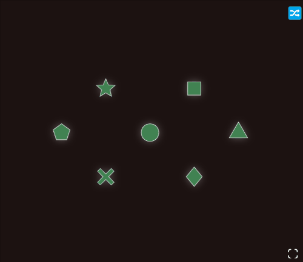
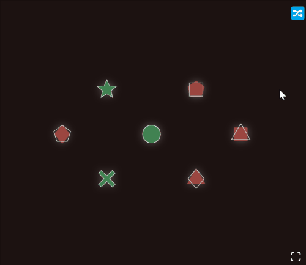

# about  

https://loop-intersection-puzzle.netlify.app/  

tis a small puzzle game from January 2021 where items are rotated around two interlocked loops and need to be returned to their original position.  

i got the idea while working on [torustiles](https://github.com/flurrux/torustiles).  

---

## how to play  

press `d` to rotate the left loop clockwise.  
press `s` to rotate the left loop counterclockwise.  

press `l` to rotate the right loop clockwise.  
press `j` to rotate the right loop counterclockwise.  

on a touch device, you can simply swipe up/down on either side of the screen:  

---

with a little bit of effort it should be possible to figure out a general solution, but i did not go that far.   
i did find some fundamental permutations though, by unsystematically playing around.  
those are saved in the `videos/projects/gear-puzzle` folder on my backup drive.  